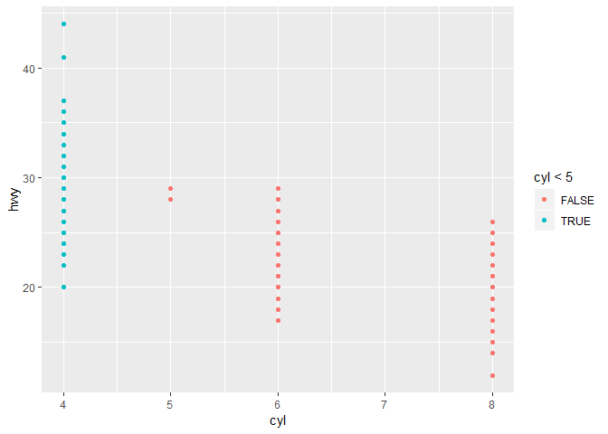

Following along with the text in **3.2**, 

```r
library(tidyverse)
```

```
## Warning: package 'tidyverse' was built under R version 3.5.3
```

```
## -- Attaching packages -------------------------------------------------------------------------------------------------- tidyverse 1.2.1 --
```

```
## v ggplot2 3.1.0     v purrr   0.3.0
## v tibble  2.1.1     v dplyr   0.8.1
## v tidyr   0.8.3     v stringr 1.3.1
## v readr   1.3.1     v forcats 0.4.0
```

```
## Warning: package 'tibble' was built under R version 3.5.3
```

```
## Warning: package 'tidyr' was built under R version 3.5.3
```

```
## Warning: package 'readr' was built under R version 3.5.3
```

```
## Warning: package 'dplyr' was built under R version 3.5.3
```

```
## Warning: package 'forcats' was built under R version 3.5.3
```

```
## -- Conflicts ----------------------------------------------------------------------------------------------------- tidyverse_conflicts() --
## x dplyr::filter() masks stats::filter()
## x dplyr::lag()    masks stats::lag()
```

```r
mpg
```

```
## # A tibble: 234 x 11
##    manufacturer model displ  year   cyl trans drv     cty   hwy fl    class
##    <chr>        <chr> <dbl> <int> <int> <chr> <chr> <int> <int> <chr> <chr>
##  1 audi         a4      1.8  1999     4 auto~ f        18    29 p     comp~
##  2 audi         a4      1.8  1999     4 manu~ f        21    29 p     comp~
##  3 audi         a4      2    2008     4 manu~ f        20    31 p     comp~
##  4 audi         a4      2    2008     4 auto~ f        21    30 p     comp~
##  5 audi         a4      2.8  1999     6 auto~ f        16    26 p     comp~
##  6 audi         a4      2.8  1999     6 manu~ f        18    26 p     comp~
##  7 audi         a4      3.1  2008     6 auto~ f        18    27 p     comp~
##  8 audi         a4 q~   1.8  1999     4 manu~ 4        18    26 p     comp~
##  9 audi         a4 q~   1.8  1999     4 auto~ 4        16    25 p     comp~
## 10 audi         a4 q~   2    2008     4 manu~ 4        20    28 p     comp~
## # ... with 224 more rows
```

```r
?mpg
```

```
## starting httpd help server ...
```

```
##  done
```

```r
ggplot(data = mpg) + 
  geom_point(mapping = aes(x = displ, y = hwy))
```

<!-- -->

###3.2.4 Problems 1-5    

* 1. 

```r
ggplot(data = mpg)
```

<!-- -->

An empty box is created. More specifically, an empty coordinate system with `mpg` data is created by the command.

* 2. 

```r
dim(mpg)
```

```
## [1] 234  11
```

The data frame is 234 rows by 11 columns. 

* 3. The `drv` variable describes the mode of driving of the cars; it tells whether a car is a four-wheel drive, a rear-wheel drive, or a four-wheel drive. 

* 4. See the below code and accompanying graph: 

```r
ggplot(data = mpg) + geom_point(mapping = aes(x = cyl, y = hwy))
```

<!-- -->

* 5. 

```r
ggplot( data = mpg) + geom_point(mapping = aes(x = drv, y = class))
```

<!-- -->

The scatterplot is not useful because both of the variables are  categorical variables, not numeric ones. The graph does not present any more additional information regarding the number of cars within each pairwise-defined category. 


###3.3.1 Problems 1-6  

* 1. The following code

```r
ggplot(data = mpg) + 
  geom_point(mapping = aes(x = displ, y = hwy, color = "blue"))
```

is wrong because the `color` argument, which sets the color of points on the plot manually, is within the `aes` argument. To set a parameter manually, the argument must lie outside the `aes` argument. 

* 2. 

```r
mpg
```

```
## # A tibble: 234 x 11
##    manufacturer model displ  year   cyl trans drv     cty   hwy fl    class
##    <chr>        <chr> <dbl> <int> <int> <chr> <chr> <int> <int> <chr> <chr>
##  1 audi         a4      1.8  1999     4 auto~ f        18    29 p     comp~
##  2 audi         a4      1.8  1999     4 manu~ f        21    29 p     comp~
##  3 audi         a4      2    2008     4 manu~ f        20    31 p     comp~
##  4 audi         a4      2    2008     4 auto~ f        21    30 p     comp~
##  5 audi         a4      2.8  1999     6 auto~ f        16    26 p     comp~
##  6 audi         a4      2.8  1999     6 manu~ f        18    26 p     comp~
##  7 audi         a4      3.1  2008     6 auto~ f        18    27 p     comp~
##  8 audi         a4 q~   1.8  1999     4 manu~ 4        18    26 p     comp~
##  9 audi         a4 q~   1.8  1999     4 auto~ 4        16    25 p     comp~
## 10 audi         a4 q~   2    2008     4 manu~ 4        20    28 p     comp~
## # ... with 224 more rows
```

By simply examining the data frame, we can see that the variables `manufacturer`, `model`, `trans`, `drv`, `fl`, and `class` are categorical variables (not numeric), while the variables `displ`, `year`, `cyl`, `cty`, and `hwy` are continuous (numeric). All categorical variables are marked with a `<chr>` beneath the variable name (for "character") while continuous variables are marked with other designations, such as `<dbl>` or `<int>` (for integer).

* 3. Mapping a continuous variable like `displ` to shape, color, or size, we could create the following modifications of the graph from 3.2.4.4;

```r
ggplot(data = mpg) + geom_point(mapping = aes(x = cyl, y = hwy, size = displ ))
```

<!-- -->

```r
ggplot(data = mpg) + geom_point(mapping = aes(x = cyl, y = hwy, color = displ ))
```

<!-- -->

Note that shape cannot be mapped to a continuous variable in ggplot (as there would need to be an infinite amount of shapes). However, if we were to instead map a categorical variable such as `model` to shape, color, or size, the same graph would look like: 

```r
ggplot(data = mpg) + geom_point(mapping = aes(x = cyl, y = hwy, size = model ))
```

```
## Warning: Using size for a discrete variable is not advised.
```

<!-- -->

```r
ggplot(data = mpg) + geom_point(mapping = aes(x = cyl, y = hwy, color = model ))
```

<!-- -->

```r
ggplot(data = mpg) + geom_point(mapping = aes(x = cyl, y = hwy, shape = model ))
```

```
## Warning: The shape palette can deal with a maximum of 6 discrete values
## because more than 6 becomes difficult to discriminate; you have
## 38. Consider specifying shapes manually if you must have them.
```

```
## Warning: Removed 199 rows containing missing values (geom_point).
```

<!-- -->

When a continuous variable is mapped to size or color, the differences in the variable's values is expressed by a gradient in size or color; in short, size and color are treated as continuous variables themselves, with respect to their values, so that continuous variables can be mapped to them. When a categorical variable is mapped to size, color, or shape, each different variable value (or name) is explicitly mapped to a different size, color, or shape (although the number of shapes is limited to 6). 

* 4. If we were to attempt to map `displ` to both size and color at the same time, we would find: 

```r
ggplot(data = mpg) + geom_point(mapping = aes(x = cyl, y = hwy, size = displ, color = displ))
```

<!-- -->

`ggplot()` is able to successfully map the variable to both size and color simultaneously. Although it's a bit redundant, it still looks a bit prettier. 

* 5. 

```r
?geom_point
vignette("ggplot2-specs")
```

The `stroke` aesthetic controls the width of shapes with a border. As such, the `stroke` aesthetic only works for shapes in R that have aborder. 

* 6. 

```r
ggplot(data = mpg) + geom_point(mapping = aes(x = cyl, y = hwy, color = cyl < 5))
```

<!-- -->

If an aesthetic is mapped to a logical argument (like `displ <5`) then the points are colored according to the results of that logical argument. In the above code, all points that have a `cyl` value of less than 5 are colored blue, while all points that have a `cyl` value of greater than or equal to 5 are colored red. 


###3.5.1 Problems 1-6

* 1. If we attempt to facet on a continuous variable, such as `year`, we would find 

```r
ggplot(data = mpg) + geom_point(aes(x = hwy, y = cty)) + facet_wrap(~displ, ncol = 4)
```

<!-- -->

When facetting on a continuous variable, ggplot facets by every possible value of the continuous variable present in the data. This often results in too many plots to draw useful inferences about the data, or in plots that contain only a single point. 

* 2. The given plot is 

```r
ggplot(data = mpg) + 
  geom_point(mapping = aes(x = drv, y = cyl))
```

<!-- -->

The plot with `facet_grid(drv ~ cyl)` is the graph of `hwy` vs `displ` faceted by `drv` and `cyl`. It facets by every pairwise combination of those variables. As shown by the graph of `cyl` vs `drv` above, there is no point in our data such that `cyl` = 4, `drv` = r; accordingly, the corresponding graph contains no points. 

* 3. 

```r
ggplot(data = mpg) + 
  geom_point(mapping = aes(x = displ, y = hwy)) +
  facet_grid(drv ~ .)
```

<!-- -->

```r
ggplot(data = mpg) + 
  geom_point(mapping = aes(x = displ, y = hwy)) +
  facet_grid(. ~ cyl)
```

<!-- -->

Both sets of code create a scatterplot of `hwy` vs `displ` and facets the data using a grid. However, including the `.` in the `facet_grid()` argument allows one of the dimensions in the grid to be left blank. Thus, the data is faceted only according to the data in the row or column section of the argument. 

* 4. The advantages of faceting to incorporate additional variables instead of using an additional aesthetic are that the differences between the different faceted variables are more clearly illustrated. In the first graph, mapping `class` to `color` would have created many different colored points, since many values of `class` are present in the data. On the other hand, mapping additional variables to an aesthetic allows different variables to be directly compared on the same graph; faceted graphs are not as easily compared to one another. For larger data sets, faceting would most likely be preferred, in order to preserve clarity of the presented information on the graph (in other words, a graph with 10+ different colors would likely be very chaotic!). 

* 5. 

```r
?facet_wrap
```

`ncol` and `nrow` allow the number of columns or rows in the faceted data to be set manually in `facet_wrap`. `facet_grid` does not have an `ncol` or `nrow` argument, since the number of columns or rows is not arbitrary; it depends on the data being faceted. In other words, the actual layout of the graph depends on a grid of data that would be disrupted if the column or row number was set manually. 

* 6. Simply put, the variable with more values should be put in the columns position when faceting the data, since we can scroll down but scrolling side-to-side is often more tedious. 

###3.6.1 Problems 1-6

* 1. `geom_smooth` or `geom_segment` could be used to create a line chart; `geom_boxplot` creates a boxplot; `geom_histogram` could be used to create a histogram; and `geom_area` could be used to create an area plot. 

* 2. Prediction: the code creates a graph of `hwy` vs `displ`, creates a scatterplot of the data (with points colored by their `drv` level), and also creates a line on the same graph (using `geom_smooth`, creating a different colored line for the means of each `drv` level and omitting standard error for the means). 

```r
ggplot(data = mpg, mapping = aes(x = displ, y = hwy, color = drv)) + 
  geom_point() + 
  geom_smooth(se = FALSE)
```

```
## `geom_smooth()` using method = 'loess' and formula 'y ~ x'
```

<!-- -->

* 3. The argument `show.legend = FALSE` omits the legend from graphs created using ggplot, wherein the data is sorted by color, shape, or size. It may be used when a legend is not explicitly required. 

* 4. `se` in `geom_smooth` removes or adds the standard error bars from graphs of means created using ggplot (`se = TRUE` by default). 

* 5. 

```r
ggplot(data = mpg, mapping = aes(x = displ, y = hwy)) + 
  geom_point() + 
  geom_smooth()
```

```
## `geom_smooth()` using method = 'loess' and formula 'y ~ x'
```

<!-- -->

```r
ggplot() + 
  geom_point(data = mpg, mapping = aes(x = displ, y = hwy)) + 
  geom_smooth(data = mpg, mapping = aes(x = displ, y = hwy))
```

```
## `geom_smooth()` using method = 'loess' and formula 'y ~ x'
```

<!-- -->

As shown above, the graphs do not look different! The same data that would normally be contained within `ggplot()` is instead relegated inside the arguments for the different `geom` functions. Therefore, the graphs are created from the same data. 

* 6. Selecting graph #4. 

```r
ggplot(data = mpg, mapping = aes(x = displ, y = hwy)) + geom_point(mapping = aes(color = drv), size = 4) + geom_smooth(se = FALSE, size = 4)
```

```
## `geom_smooth()` using method = 'loess' and formula 'y ~ x'
```

<!-- -->

