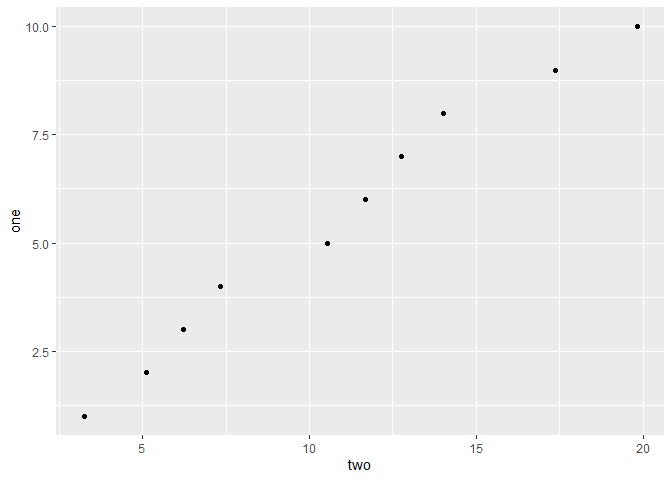

##Week 4 Exercises


```r
library(tidyverse)
```

```
## Warning: package 'tidyverse' was built under R version 3.5.3
```

```
## -- Attaching packages --------------------------------------------------------------------------------------------------- tidyverse 1.2.1 --
```

```
## v ggplot2 3.2.0     v purrr   0.3.0
## v tibble  2.1.1     v dplyr   0.8.1
## v tidyr   0.8.3     v stringr 1.3.1
## v readr   1.3.1     v forcats 0.4.0
```

```
## Warning: package 'ggplot2' was built under R version 3.5.3
```

```
## Warning: package 'tibble' was built under R version 3.5.3
```

```
## Warning: package 'tidyr' was built under R version 3.5.3
```

```
## Warning: package 'readr' was built under R version 3.5.3
```

```
## Warning: package 'dplyr' was built under R version 3.5.3
```

```
## Warning: package 'forcats' was built under R version 3.5.3
```

```
## -- Conflicts ------------------------------------------------------------------------------------------------------ tidyverse_conflicts() --
## x dplyr::filter() masks stats::filter()
## x dplyr::lag()    masks stats::lag()
```

###10.5 Exercises

**Problem 1**

```r
mt_tibble <- as_tibble(mtcars)
mt_tibble
```

```
## # A tibble: 32 x 11
##      mpg   cyl  disp    hp  drat    wt  qsec    vs    am  gear  carb
##    <dbl> <dbl> <dbl> <dbl> <dbl> <dbl> <dbl> <dbl> <dbl> <dbl> <dbl>
##  1  21       6  160    110  3.9   2.62  16.5     0     1     4     4
##  2  21       6  160    110  3.9   2.88  17.0     0     1     4     4
##  3  22.8     4  108     93  3.85  2.32  18.6     1     1     4     1
##  4  21.4     6  258    110  3.08  3.22  19.4     1     0     3     1
##  5  18.7     8  360    175  3.15  3.44  17.0     0     0     3     2
##  6  18.1     6  225    105  2.76  3.46  20.2     1     0     3     1
##  7  14.3     8  360    245  3.21  3.57  15.8     0     0     3     4
##  8  24.4     4  147.    62  3.69  3.19  20       1     0     4     2
##  9  22.8     4  141.    95  3.92  3.15  22.9     1     0     4     2
## 10  19.2     6  168.   123  3.92  3.44  18.3     1     0     4     4
## # ... with 22 more rows
```

```r
mtcars
```

```
##                      mpg cyl  disp  hp drat    wt  qsec vs am gear carb
## Mazda RX4           21.0   6 160.0 110 3.90 2.620 16.46  0  1    4    4
## Mazda RX4 Wag       21.0   6 160.0 110 3.90 2.875 17.02  0  1    4    4
## Datsun 710          22.8   4 108.0  93 3.85 2.320 18.61  1  1    4    1
## Hornet 4 Drive      21.4   6 258.0 110 3.08 3.215 19.44  1  0    3    1
## Hornet Sportabout   18.7   8 360.0 175 3.15 3.440 17.02  0  0    3    2
## Valiant             18.1   6 225.0 105 2.76 3.460 20.22  1  0    3    1
## Duster 360          14.3   8 360.0 245 3.21 3.570 15.84  0  0    3    4
## Merc 240D           24.4   4 146.7  62 3.69 3.190 20.00  1  0    4    2
## Merc 230            22.8   4 140.8  95 3.92 3.150 22.90  1  0    4    2
## Merc 280            19.2   6 167.6 123 3.92 3.440 18.30  1  0    4    4
## Merc 280C           17.8   6 167.6 123 3.92 3.440 18.90  1  0    4    4
## Merc 450SE          16.4   8 275.8 180 3.07 4.070 17.40  0  0    3    3
## Merc 450SL          17.3   8 275.8 180 3.07 3.730 17.60  0  0    3    3
## Merc 450SLC         15.2   8 275.8 180 3.07 3.780 18.00  0  0    3    3
## Cadillac Fleetwood  10.4   8 472.0 205 2.93 5.250 17.98  0  0    3    4
## Lincoln Continental 10.4   8 460.0 215 3.00 5.424 17.82  0  0    3    4
## Chrysler Imperial   14.7   8 440.0 230 3.23 5.345 17.42  0  0    3    4
## Fiat 128            32.4   4  78.7  66 4.08 2.200 19.47  1  1    4    1
## Honda Civic         30.4   4  75.7  52 4.93 1.615 18.52  1  1    4    2
## Toyota Corolla      33.9   4  71.1  65 4.22 1.835 19.90  1  1    4    1
## Toyota Corona       21.5   4 120.1  97 3.70 2.465 20.01  1  0    3    1
## Dodge Challenger    15.5   8 318.0 150 2.76 3.520 16.87  0  0    3    2
## AMC Javelin         15.2   8 304.0 150 3.15 3.435 17.30  0  0    3    2
## Camaro Z28          13.3   8 350.0 245 3.73 3.840 15.41  0  0    3    4
## Pontiac Firebird    19.2   8 400.0 175 3.08 3.845 17.05  0  0    3    2
## Fiat X1-9           27.3   4  79.0  66 4.08 1.935 18.90  1  1    4    1
## Porsche 914-2       26.0   4 120.3  91 4.43 2.140 16.70  0  1    5    2
## Lotus Europa        30.4   4  95.1 113 3.77 1.513 16.90  1  1    5    2
## Ford Pantera L      15.8   8 351.0 264 4.22 3.170 14.50  0  1    5    4
## Ferrari Dino        19.7   6 145.0 175 3.62 2.770 15.50  0  1    5    6
## Maserati Bora       15.0   8 301.0 335 3.54 3.570 14.60  0  1    5    8
## Volvo 142E          21.4   4 121.0 109 4.11 2.780 18.60  1  1    4    2
```
As far as I can see, the only difference between a data frame and its corresponding tibble is that each entry in the rows must be associated with a variable in a tibble. In coercing `mtcars` to tibble form, a column without a header was discarded. 

**Problem 2**

For the data frame:

```r
df <- data.frame(abc = 1, xyz = "a")
df
```

```
##   abc xyz
## 1   1   a
```

```r
df$x
```

```
## [1] a
## Levels: a
```

```r
df[, "xyz"]
```

```
## [1] a
## Levels: a
```

```r
df[, c("abc", "xyz")]
```

```
##   abc xyz
## 1   1   a
```


```r
df2 <- as_tibble(df)
df2
```

```
## # A tibble: 1 x 2
##     abc xyz  
##   <dbl> <fct>
## 1     1 a
```

```r
df2$x
```

```
## Warning: Unknown or uninitialised column: 'x'.
```

```
## NULL
```

```r
df2[, "xyz"]
```

```
## # A tibble: 1 x 1
##   xyz  
##   <fct>
## 1 a
```

```r
df2[, c("abc", "xyz")]
```

```
## # A tibble: 1 x 2
##     abc xyz  
##   <dbl> <fct>
## 1     1 a
```
For the first command, the same data frame/tibble is created. For the second command, the data frame calls the entries in `df$xyz`, but the corresponding tibble does not (the call does not exactly match the column name). This could potentially be an issue with working with a data frame; a mistyped call might not be easily noticed. The third and fourth commands do the same thing for both the tibble and data frame, since the exact column names are supplied. 

**Problem 4**

```r
annoying <- tibble(
  `1` = 1:10,
  `2` = `1` * 2 + rnorm(length(`1`))
)
```

I'm doing #4 first, because it's easier. 

```r
#Number 4
better <- rename(annoying, one = "1", two = "2")
better
```

```
## # A tibble: 10 x 2
##      one   two
##    <int> <dbl>
##  1     1  3.24
##  2     2  5.11
##  3     3  6.22
##  4     4  7.34
##  5     5 10.5 
##  6     6 11.7 
##  7     7 12.8 
##  8     8 14.0 
##  9     9 17.4 
## 10    10 19.8
```

Now the rest, in regular order: 

```r
better$one
```

```
##  [1]  1  2  3  4  5  6  7  8  9 10
```

```r
ggplot(better, mapping = aes(x = two, y = one)) + 
  geom_point()
```

<!-- -->

```r
mutate(better, three = two/one)
```

```
## # A tibble: 10 x 3
##      one   two three
##    <int> <dbl> <dbl>
##  1     1  3.24  3.24
##  2     2  5.11  2.56
##  3     3  6.22  2.07
##  4     4  7.34  1.84
##  5     5 10.5   2.11
##  6     6 11.7   1.95
##  7     7 12.8   1.82
##  8     8 14.0   1.75
##  9     9 17.4   1.93
## 10    10 19.8   1.98
```

**Problem 5**

```r
?enframe()
```

```
## starting httpd help server ... done
```
The command can be used to convert atomic vectors into tibbles. Another neat way of moving between different types of data!

###11.2.2 Exercises

**Problem 1**
`read_delim()` would probably work pretty well. 

**Problem 4**

```r
read_delim("x,y\n 1,'a,b'", delim = ",", quote = "'")
```

```
## # A tibble: 1 x 2
##   x     y    
##   <chr> <chr>
## 1 " 1"  a,b
```
_OOOF_ that took a while 

**Problem 5**
`read_csv("a,b\n1,2,3\n4,5,6")`: There are more entries per row than variables, so R gets confused. 
`read_csv("a,b,c\n1,2\n1,2,3,4")`: This has the same problem; entries and variables don't match up. 
`read_csv("a,b\n\"1")`: There's an extra `\`? Also more variables than entries? Very confused about what is trying to be accomplished here. 

```r
read_csv("a,b\n1,2\na,b")
```

```
## # A tibble: 2 x 2
##   a     b    
##   <chr> <chr>
## 1 1     2    
## 2 a     b
```
This one actually runs just fine. Having an entry be the same as a variable might be confusing, though. 
`read_csv("a;b\n1;3")`: Will not run using `read_csv`. Try `read_delim` instead, specifying `;` in the `delim` argument. 


###11.3.4 Exercises

**Problem 1**

```r
?locale()
```
`date_names`,`date_format`,`time_format`,`decimal_mark`,`grouping_mark`, `tz` (for time zones), and `encoding` are all major arguments for `locale`. Basically, just remember that this argument allows for shifting between regional differences in data. 

**Problem 2**
`parse_number("100,000", locale = locale(grouping_mark = ",", decimal_mark = ","))` returns an error message when executed; obviously, the grouping mark and decimal mark must be different for `parse_number` to correctly parse a number. 

```r
parse_number(c("100,000,", "100.000"), locale = locale(decimal_mark = ",")) 
```

```
## [1] 1e+02 1e+05
```

```r
parse_number(c("100,000,", "100.000"), locale = locale(grouping_mark = ".")) 
```

```
## [1] 1e+02 1e+05
```

As shown above, the grouping mark becomes `.`, resulting in the parse shown above. The same result is shown when `group_mark = "."`.

**Problem 3**
The arguments alter default date and time formats. Like some of the arguments shown in `parse_date`, they allow manual setting of the date-time format. 

```r
parse_date("11.11.2020", locale = locale(date_format = "%m.%d.%Y"))
```

```
## [1] "2020-11-11"
```

**Problem 7**
Hoo boy. 

```r
d1 <- "January 1, 2010"
d2 <- "2015-Mar-07"
d3 <- "06-Jun-2017"
d4 <- c("August 19 (2015)", "July 1 (2015)")
d5 <- "12/30/14" # Dec 30, 2014
t1 <- "1705"
t2 <- "11:15:10.12 PM"

parse_date(d1, "%B %d, %Y")
```

```
## [1] "2010-01-01"
```

```r
parse_date(d2, "%Y-%b-%d")
```

```
## [1] "2015-03-07"
```

```r
parse_date(d3, "%d-%b-%Y")
```

```
## [1] "2017-06-06"
```

```r
parse_date(d4, "%B %d (%Y)")
```

```
## [1] "2015-08-19" "2015-07-01"
```

```r
parse_date(d5, "%m/%d/%y")
```

```
## [1] "2014-12-30"
```

```r
parse_time(t1, "%H%M")
```

```
## 17:05:00
```

```r
parse_time(t2, "%I:%M:%S %p")
```

```
## 23:15:10
```
**I think I did this last one right? It's hard to tell, since it parse correctly. What does the .12 represent**
