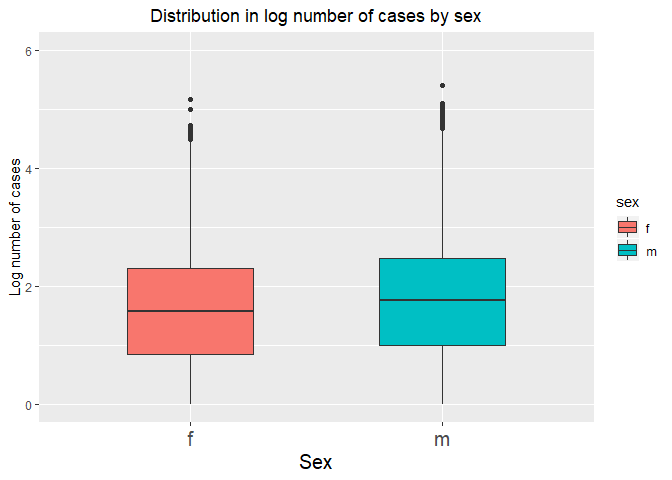

##Week 6 Exercises


```r
library(tidyverse)
```

```
## Warning: package 'tidyverse' was built under R version 3.5.3
```

```
## -- Attaching packages -------------------------------------------------------------------------------------------------- tidyverse 1.2.1 --
```

```
## v ggplot2 3.2.0     v purrr   0.3.0
## v tibble  2.1.1     v dplyr   0.8.1
## v tidyr   0.8.3     v stringr 1.3.1
## v readr   1.3.1     v forcats 0.4.0
```

```
## Warning: package 'ggplot2' was built under R version 3.5.3
```

```
## Warning: package 'tibble' was built under R version 3.5.3
```

```
## Warning: package 'tidyr' was built under R version 3.5.3
```

```
## Warning: package 'readr' was built under R version 3.5.3
```

```
## Warning: package 'dplyr' was built under R version 3.5.3
```

```
## Warning: package 'forcats' was built under R version 3.5.3
```

```
## -- Conflicts ----------------------------------------------------------------------------------------------------- tidyverse_conflicts() --
## x dplyr::filter() masks stats::filter()
## x dplyr::lag()    masks stats::lag()
```

###12.2.1 Problems

Problem 1: I thought about it, I promise!

Problem 2: 

```r
#For table 2 first:
table2
```

```
## # A tibble: 12 x 4
##    country      year type            count
##    <chr>       <int> <chr>           <int>
##  1 Afghanistan  1999 cases             745
##  2 Afghanistan  1999 population   19987071
##  3 Afghanistan  2000 cases            2666
##  4 Afghanistan  2000 population   20595360
##  5 Brazil       1999 cases           37737
##  6 Brazil       1999 population  172006362
##  7 Brazil       2000 cases           80488
##  8 Brazil       2000 population  174504898
##  9 China        1999 cases          212258
## 10 China        1999 population 1272915272
## 11 China        2000 cases          213766
## 12 China        2000 population 1280428583
```

```r
cases2 <- filter(table2, type == "cases")
population2 <- filter(table2, type == "population")
rate <- (cases2$count/population2$count)*10000
rate
```

```
## [1] 0.372741 1.294466 2.193930 4.612363 1.667495 1.669488
```

```r
table2_rate <- enframe(rate)
table2_rate
```

```
## # A tibble: 6 x 2
##    name value
##   <int> <dbl>
## 1     1 0.373
## 2     2 1.29 
## 3     3 2.19 
## 4     4 4.61 
## 5     5 1.67 
## 6     6 1.67
```

```r
country <- c("Afghanistan", "Afghanistan", "Brazil", "Brazil", "China", "China")
years <- c(1999, 2000, 1999, 2000, 1999, 2000)
table2_rate <- add_column(table2_rate, country, years, cases = cases2$count)
table2_rate <- rename(table2_rate, rate = value)
table2_rate <- select(table2_rate, -(name))
table2_rate
```

```
## # A tibble: 6 x 4
##    rate country     years  cases
##   <dbl> <chr>       <dbl>  <int>
## 1 0.373 Afghanistan  1999    745
## 2 1.29  Afghanistan  2000   2666
## 3 2.19  Brazil       1999  37737
## 4 4.61  Brazil       2000  80488
## 5 1.67  China        1999 212258
## 6 1.67  China        2000 213766
```

**Yeesh.** Now, table 4a + 4b:

```r
table4a
```

```
## # A tibble: 3 x 3
##   country     `1999` `2000`
## * <chr>        <int>  <int>
## 1 Afghanistan    745   2666
## 2 Brazil       37737  80488
## 3 China       212258 213766
```

```r
table4b
```

```
## # A tibble: 3 x 3
##   country         `1999`     `2000`
## * <chr>            <int>      <int>
## 1 Afghanistan   19987071   20595360
## 2 Brazil       172006362  174504898
## 3 China       1272915272 1280428583
```

```r
cases4a <- c(table4a$"1999", table4a$"2000")
population4b <- c(table4b$"1999", table4b$"2000")
cases4a
```

```
## [1]    745  37737 212258   2666  80488 213766
```

```r
population4b
```

```
## [1]   19987071  172006362 1272915272   20595360  174504898 1280428583
```

```r
rate <- (cases4a/population4b)*10000
year <- c("1999", "1999", "1999", "2000", "2000", "2000")
country <- c("Afghanistan", "Brazil", "China", "Afghanistan", "Brazil", "China")
table4ab <- tibble(country, year, rate)
table4ab
```

```
## # A tibble: 6 x 3
##   country     year   rate
##   <chr>       <chr> <dbl>
## 1 Afghanistan 1999  0.373
## 2 Brazil      1999  2.19 
## 3 China       1999  1.67 
## 4 Afghanistan 2000  1.29 
## 5 Brazil      2000  4.61 
## 6 China       2000  1.67
```

Man, this problem sucks. Who the hell would build a dataset like this?!? The second two tables (`4a` and `4b`) proved slightly easier to work with, since each observation had its own column (versus `2a`, wherein each observation had its own row). 


Problem 3: 
I simply added the case observations from `table2a` to the final tibble I made above. Therefore, we can simply copy the code: 

```r
ggplot(table2_rate, aes(years, cases)) + 
  geom_line(aes(group = country), colour = "grey50") + 
  geom_point(aes(colour = country))
```

<!-- -->

I did it. EZPZ. 

###12.3.3 Problems 

Problem 1: The example is

```r
stocks <- tibble(
  year   = c(2015, 2015, 2016, 2016),
  half  = c(   1,    2,     1,    2),
  return = c(1.88, 0.59, 0.92, 0.17)
)
stocks
```

```
## # A tibble: 4 x 3
##    year  half return
##   <dbl> <dbl>  <dbl>
## 1  2015     1   1.88
## 2  2015     2   0.59
## 3  2016     1   0.92
## 4  2016     2   0.17
```

```r
stocks %>% 
  spread(year, return) %>% 
  gather("year", "return", `2015`:`2016`)
```

```
## # A tibble: 4 x 3
##    half year  return
##   <dbl> <chr>  <dbl>
## 1     1 2015    1.88
## 2     2 2015    0.59
## 3     1 2016    0.92
## 4     2 2016    0.17
```

```r
#Let's break it down a bit: 
spread_stocks <- spread(stocks, key = year, value = return)
spread_stocks
```

```
## # A tibble: 2 x 3
##    half `2015` `2016`
##   <dbl>  <dbl>  <dbl>
## 1     1   1.88   0.92
## 2     2   0.59   0.17
```

```r
gather(spread_stocks, "year", "return", `2015` : `2016`)
```

```
## # A tibble: 4 x 3
##    half year  return
##   <dbl> <chr>  <dbl>
## 1     1 2015    1.88
## 2     2 2015    0.59
## 3     1 2016    0.92
## 4     2 2016    0.17
```
In the initial `spread` function, year and return were column names. However, in `gather`, year and return were new column names that we were creating, so we needed to use quotations to describe them. We also needed to specify which columns to gather and how to gather them. When R turns columns to rows, it needs more guidance. 


```r
?spread
```

```
## starting httpd help server ... done
```

```r
?gather
```

`convert` is a freaking useful argument! It parses new columns as it reorganizes them, allowing for more accurate representation of the data. 

Problem 2

```r
table4a
```

```
## # A tibble: 3 x 3
##   country     `1999` `2000`
## * <chr>        <int>  <int>
## 1 Afghanistan    745   2666
## 2 Brazil       37737  80488
## 3 China       212258 213766
```

```r
table4a %>% 
  gather(`1999`, `2000`, key = "year", value = "cases")
```

```
## # A tibble: 6 x 3
##   country     year   cases
##   <chr>       <chr>  <int>
## 1 Afghanistan 1999     745
## 2 Brazil      1999   37737
## 3 China       1999  212258
## 4 Afghanistan 2000    2666
## 5 Brazil      2000   80488
## 6 China       2000  213766
```

Fixed the above code. 1999 and 2000 are non-syntactic column names, so they needed a backtick. 

Problem 3: 

```r
people <- tribble(
  ~name,             ~key,    ~value,  ~ID,
  #-----------------|--------|-------|------
  "Phillip Woods",   "age",       45,   1,
  "Phillip Woods",   "height",   186,   2,
  "Phillip Woods",   "age",       50,   3,
  "Jessica Cordero", "age",       37,   4,
  "Jessica Cordero", "height",   156,   5
)
people
```

```
## # A tibble: 5 x 4
##   name            key    value    ID
##   <chr>           <chr>  <dbl> <dbl>
## 1 Phillip Woods   age       45     1
## 2 Phillip Woods   height   186     2
## 3 Phillip Woods   age       50     3
## 4 Jessica Cordero age       37     4
## 5 Jessica Cordero height   156     5
```

```r
spread(data = people, key = key, value = value)
```

```
## # A tibble: 5 x 4
##   name               ID   age height
##   <chr>           <dbl> <dbl>  <dbl>
## 1 Jessica Cordero     4    37     NA
## 2 Jessica Cordero     5    NA    156
## 3 Phillip Woods       1    45     NA
## 4 Phillip Woods       2    NA    186
## 5 Phillip Woods       3    50     NA
```

Spreading the tibble fails initially because two observations, Phillip Woods, share the same age value; therefore, an even spread of the data into two equally sized columns cannot occur. Adding an ID column permits spreading, but the data set still looks awkward (as it always will when the values for a particular variable are not equal in length). 

Problem 4: 

```r
preg <- tribble(
  ~pregnant, ~male, ~female,
  "yes",     NA,    10,
  "no",      20,    12
)
preg
```

```
## # A tibble: 2 x 3
##   pregnant  male female
##   <chr>    <dbl>  <dbl>
## 1 yes         NA     10
## 2 no          20     12
```

```r
#It's pretty clear that the `NA` here represents zero. Therefore, replace all NA's with 0: 
preg[is.na(preg)] <- 0
preg
```

```
## # A tibble: 2 x 3
##   pregnant  male female
##   <chr>    <dbl>  <dbl>
## 1 yes          0     10
## 2 no          20     12
```

```r
preg_tidy <- gather(preg, male, female, key = "sex", value = "count")
preg_tidy
```

```
## # A tibble: 4 x 3
##   pregnant sex    count
##   <chr>    <chr>  <dbl>
## 1 yes      male       0
## 2 no       male      20
## 3 yes      female    10
## 4 no       female    12
```

###12.4.3 Problems 

Problem 1: 

```r
tibble(x = c("a,b,c", "d,e,f,g", "h,i,j")) %>% 
  separate(x, c("one", "two", "three"), extra = "merge")
```

```
## # A tibble: 3 x 3
##   one   two   three
##   <chr> <chr> <chr>
## 1 a     b     c    
## 2 d     e     f,g  
## 3 h     i     j
```

```r
#When you use `drop`, drop extra values eithout warning; when you use `merge  , merge extra values into a single entry. 

tibble(x = c("a,b,c", "d,e", "f,g,i")) %>% 
  separate(x, c("one", "two", "three"), fill = "left")
```

```
## # A tibble: 3 x 3
##   one   two   three
##   <chr> <chr> <chr>
## 1 a     b     c    
## 2 <NA>  d     e    
## 3 f     g     i
```

```r
#When you use `fill`, you just tell `separate` where to add NA's. 
```

Problem 2: In both `unite` and `separate`, `remove = TRUE` by default. It removes input column(s) from the resulting data frame. You could set it to false if you wanted to keep the old columns; for example, in `table3`, you might want to keep `rate`: 

```r
table3 %>% 
  separate(rate, into = c("cases", "population"), convert = TRUE, remove = FALSE)
```

```
## # A tibble: 6 x 5
##   country      year rate               cases population
##   <chr>       <int> <chr>              <int>      <int>
## 1 Afghanistan  1999 745/19987071         745   19987071
## 2 Afghanistan  2000 2666/20595360       2666   20595360
## 3 Brazil       1999 37737/172006362    37737  172006362
## 4 Brazil       2000 80488/174504898    80488  174504898
## 5 China        1999 212258/1272915272 212258 1272915272
## 6 China        2000 213766/1280428583 213766 1280428583
```

Problem 3: I'm not really sure what the difference between `extract` and `separate` is. As for why there are multiple versions of `separate`, it's likely because there are many ways to separate a column into new columns (for example, there can be any number of output columns) but there is only one way to combine several columns into one (a single output). 

###12.6.1 Problems

Problem 3: 

```r
#Are `iso2` and `iso3` actually redundant in `who`?
who
```

```
## # A tibble: 7,240 x 60
##    country iso2  iso3   year new_sp_m014 new_sp_m1524 new_sp_m2534
##    <chr>   <chr> <chr> <int>       <int>        <int>        <int>
##  1 Afghan~ AF    AFG    1980          NA           NA           NA
##  2 Afghan~ AF    AFG    1981          NA           NA           NA
##  3 Afghan~ AF    AFG    1982          NA           NA           NA
##  4 Afghan~ AF    AFG    1983          NA           NA           NA
##  5 Afghan~ AF    AFG    1984          NA           NA           NA
##  6 Afghan~ AF    AFG    1985          NA           NA           NA
##  7 Afghan~ AF    AFG    1986          NA           NA           NA
##  8 Afghan~ AF    AFG    1987          NA           NA           NA
##  9 Afghan~ AF    AFG    1988          NA           NA           NA
## 10 Afghan~ AF    AFG    1989          NA           NA           NA
## # ... with 7,230 more rows, and 53 more variables: new_sp_m3544 <int>,
## #   new_sp_m4554 <int>, new_sp_m5564 <int>, new_sp_m65 <int>,
## #   new_sp_f014 <int>, new_sp_f1524 <int>, new_sp_f2534 <int>,
## #   new_sp_f3544 <int>, new_sp_f4554 <int>, new_sp_f5564 <int>,
## #   new_sp_f65 <int>, new_sn_m014 <int>, new_sn_m1524 <int>,
## #   new_sn_m2534 <int>, new_sn_m3544 <int>, new_sn_m4554 <int>,
## #   new_sn_m5564 <int>, new_sn_m65 <int>, new_sn_f014 <int>,
## #   new_sn_f1524 <int>, new_sn_f2534 <int>, new_sn_f3544 <int>,
## #   new_sn_f4554 <int>, new_sn_f5564 <int>, new_sn_f65 <int>,
## #   new_ep_m014 <int>, new_ep_m1524 <int>, new_ep_m2534 <int>,
## #   new_ep_m3544 <int>, new_ep_m4554 <int>, new_ep_m5564 <int>,
## #   new_ep_m65 <int>, new_ep_f014 <int>, new_ep_f1524 <int>,
## #   new_ep_f2534 <int>, new_ep_f3544 <int>, new_ep_f4554 <int>,
## #   new_ep_f5564 <int>, new_ep_f65 <int>, newrel_m014 <int>,
## #   newrel_m1524 <int>, newrel_m2534 <int>, newrel_m3544 <int>,
## #   newrel_m4554 <int>, newrel_m5564 <int>, newrel_m65 <int>,
## #   newrel_f014 <int>, newrel_f1524 <int>, newrel_f2534 <int>,
## #   newrel_f3544 <int>, newrel_f4554 <int>, newrel_f5564 <int>,
## #   newrel_f65 <int>
```

```r
Checktrue <- tibble(country = who$country, iso2 = who$iso2, iso3 = who$iso3)
Checktrue
```

```
## # A tibble: 7,240 x 3
##    country     iso2  iso3 
##    <chr>       <chr> <chr>
##  1 Afghanistan AF    AFG  
##  2 Afghanistan AF    AFG  
##  3 Afghanistan AF    AFG  
##  4 Afghanistan AF    AFG  
##  5 Afghanistan AF    AFG  
##  6 Afghanistan AF    AFG  
##  7 Afghanistan AF    AFG  
##  8 Afghanistan AF    AFG  
##  9 Afghanistan AF    AFG  
## 10 Afghanistan AF    AFG  
## # ... with 7,230 more rows
```

```r
#Now check if they're all redundant. Strategy: 
# 1. Combine country, iso2, and iso3 values into one new variable, designation.  
#2. Summarise all equal designation values. 
#3. Separate the country information from designation. 
#4. Check to see how many times each country appears. If the iso2 and iso3 values are redundant, it should be at most 1 time. 

Checktrue2 <- Checktrue %>%
  unite(col = Designation, country, iso2, iso3, sep = "_") %>%
  group_by(Designation) %>%
  summarise() %>%
  separate(col = Designation, into = c("Country", "iso2", "iso3"), sep = "_")

check <- Checktrue2 %>%
  group_by(Country) %>%
  count() %>%
  arrange(n)
check 
```

```
## # A tibble: 219 x 2
## # Groups:   Country [219]
##    Country                 n
##    <chr>               <int>
##  1 Afghanistan             1
##  2 Albania                 1
##  3 Algeria                 1
##  4 American Samoa          1
##  5 Andorra                 1
##  6 Angola                  1
##  7 Anguilla                1
##  8 Antigua and Barbuda     1
##  9 Argentina               1
## 10 Armenia                 1
## # ... with 209 more rows
```

```r
#As you can see, no country appears more than once. Therefore, iso2, iso3, and country values in `who` are redundant.
```

Problem 4: I'm going to try and not totally blatantly copy code, i.e. the below code is me trying to replicate their method of tidying without looking. (I will of course copy their string change code because I don't really know how to do that.) First, tidy the data: 

```r
( who_tidy <- who %>%
  gather(new_sp_m014:newrel_f65, key = "key", value = "cases") %>%
  mutate(key = stringr::str_replace(key, "newrel", "new_rel")) %>%
  select(-(iso2:iso3)) %>%
  separate(col = "key", into = c("timing", "type", "sex_agegroup"), sep = "_") %>%
  separate(col = "sex_agegroup", into = c("sex", "age"), sep = 1)  %>%
  replace(is.na(.), 0) %>%
  arrange(desc(cases)) )
```

```
## # A tibble: 405,440 x 7
##    country  year timing type  sex   age    cases
##    <chr>   <int> <chr>  <chr> <chr> <chr>  <dbl>
##  1 India    2007 new    sn    m     3544  250051
##  2 India    2007 new    sn    f     3544  148811
##  3 China    2013 new    rel   m     65    124476
##  4 China    2013 new    rel   m     5564  112558
##  5 India    2007 new    ep    m     3544  105825
##  6 India    2007 new    ep    f     3544  101015
##  7 China    2013 new    rel   m     4554  100297
##  8 India    2009 new    sp    m     3544   90830
##  9 India    2008 new    sp    m     3544   90498
## 10 India    2010 new    sp    m     3544   90440
## # ... with 405,430 more rows
```

Next, calculate the total number of cases of TB by country, year, and sex. 
Country: 

```r
( country <- who_tidy %>%
  select(country, total_cases = cases) %>%
  group_by(country) %>%
  summarize_each(funs(sum)) %>%
  arrange(desc(total_cases)) )
```

```
## Warning: funs() is soft deprecated as of dplyr 0.8.0
## please use list() instead
## 
##   # Before:
##   funs(name = f(.))
## 
##   # After: 
##   list(name = ~ f(.))
## This warning is displayed once per session.
```

```
## # A tibble: 219 x 2
##    country                          total_cases
##    <chr>                                  <dbl>
##  1 China                                8389839
##  2 India                                7098552
##  3 South Africa                         3010272
##  4 Indonesia                            2909925
##  5 Bangladesh                           1524034
##  6 Viet Nam                              965665
##  7 Democratic Republic of the Congo      960902
##  8 Philippines                           952828
##  9 Russian Federation                    926236
## 10 Pakistan                              905629
## # ... with 209 more rows
```
  
Next, year: 

```r
( year <- who_tidy %>%
  select(year, total_cases = cases) %>%
  group_by(year) %>%
  summarize_each(funs(sum)) %>%
  arrange(year) )
```

```
## # A tibble: 34 x 2
##     year total_cases
##    <int>       <dbl>
##  1  1980         959
##  2  1981         805
##  3  1982         824
##  4  1983         786
##  5  1984         814
##  6  1985         799
##  7  1986         754
##  8  1987         670
##  9  1988         682
## 10  1989         654
## # ... with 24 more rows
```

```r
#Now, a graph: 

ggplot(year, aes(x = year, y = log10(total_cases))) + 
  geom_point(size = 2) + 
  labs(x = "Year", y = "Total number of TB cases (log scale)", title = "Log total number of TB cases by year") + 
  theme(plot.title = element_text(hjust = 0.5)) 
```

<!-- -->

That's funny. Why does a graph that should be continuous jump around so much? 

### Data Investigation!! 


```r
( investigate <- who_tidy %>%
  filter(cases >= 100) %>%
  filter(year < 1995) %>%
  arrange(year) )
```

```
## # A tibble: 17 x 7
##    country  year timing type  sex   age   cases
##    <chr>   <int> <chr>  <chr> <chr> <chr> <dbl>
##  1 Canada   1980 new    sp    m     65      186
##  2 Canada   1980 new    sp    m     5564    108
##  3 Canada   1980 new    sp    f     65      104
##  4 Canada   1980 new    sp    m     4554    100
##  5 Canada   1981 new    sp    m     65      141
##  6 Canada   1981 new    sp    m     5564    103
##  7 Canada   1982 new    sp    m     65      150
##  8 Canada   1983 new    sp    m     65      123
##  9 Canada   1984 new    sp    m     65      169
## 10 Canada   1984 new    sp    f     65      100
## 11 Canada   1985 new    sp    m     65      168
## 12 Canada   1986 new    sp    m     65      147
## 13 Canada   1987 new    sp    m     65      129
## 14 Canada   1988 new    sp    m     65      131
## 15 Canada   1989 new    sp    m     65      122
## 16 Canada   1990 new    sp    m     65      100
## 17 Canada   1991 new    sp    m     65      110
```

Welp, that's probably why. Only 17 observations with a `cases` value above 100 appeared before 1995! I bet it's because some data didn't start getting entered until 1995 or later. Many epidemiological datasets are incomplete because certain countries have poorer reporting standards and didn't begin reporting data on disease incidence until more recent years. Not only that, but these countries also tend to have higher rates of TB. India and China probably fit into this category. Let's check: 
 

```r
( investigate2 <- who_tidy %>%
    filter(country == "India" | country == "China") %>%
    filter(cases != 0) %>%
    arrange(year) )
```

```
## # A tibble: 620 x 7
##    country  year timing type  sex   age   cases
##    <chr>   <int> <chr>  <chr> <chr> <chr> <dbl>
##  1 China    1995 new    sp    m     2534  18306
##  2 China    1995 new    sp    m     3544  15487
##  3 China    1995 new    sp    m     5564  13489
##  4 China    1995 new    sp    f     2534  13250
##  5 China    1995 new    sp    m     4554  13105
##  6 China    1995 new    sp    m     1524  12791
##  7 China    1995 new    sp    f     1524  10890
##  8 China    1995 new    sp    m     65    10130
##  9 China    1995 new    sp    f     3544   8376
## 10 China    1995 new    sp    f     4554   5679
## # ... with 610 more rows
```

As the above dataset illustrates, neither India nor China began reporting case values until 1995, when we observe our "jump" in total cases worldwide. Remember that we replaced NA's with 0's during our tidying of the data. If we hadn't, we might not have observed this interesting phenomenon!

### Back to the problem. 

Now, we show data for sex: 


```r
( sex <- who_tidy %>%
  select(sex, total_cases = cases) %>%
  group_by(sex) %>%
  summarize_each(funs(sum)) )
```

```
## # A tibble: 2 x 2
##   sex   total_cases
##   <chr>       <dbl>
## 1 f        15907024
## 2 m        27490494
```

```r
#Now, let's visualize the distribution: 

(who_tidy_2 <- who_tidy %>%
  filter(cases != 0) %>%
  arrange(cases) )
```

```
## # A tibble: 64,966 x 7
##    country         year timing type  sex   age   cases
##    <chr>          <int> <chr>  <chr> <chr> <chr> <dbl>
##  1 Albania         1998 new    sp    m     014       1
##  2 Albania         2008 new    sp    m     014       1
##  3 American Samoa  1997 new    sp    m     014       1
##  4 Armenia         1995 new    sp    m     014       1
##  5 Armenia         2002 new    sp    m     014       1
##  6 Armenia         2007 new    sp    m     014       1
##  7 Armenia         2009 new    sp    m     014       1
##  8 Armenia         2012 new    sp    m     014       1
##  9 Australia       1997 new    sp    m     014       1
## 10 Australia       2001 new    sp    m     014       1
## # ... with 64,956 more rows
```

```r
ggplot(who_tidy_2, aes(x = sex, y = log10(cases))) +
  geom_boxplot(aes(fill = sex), width = 0.5) + 
  labs(x = "Sex", y = "Log number of cases", title = "Distribution in log number of cases by sex") + 
  coord_cartesian(ylim = c(0,6)) + 
  theme(plot.title = element_text(hjust = 0.5), axis.text.x = element_text(size = 15), axis.title.x = element_text(size = 15)) 
```

<!-- -->
 
We can see that the total number of cases for both males and females are roughly the same.  
  
  
  
  
  
  
  
  
  
  


  
