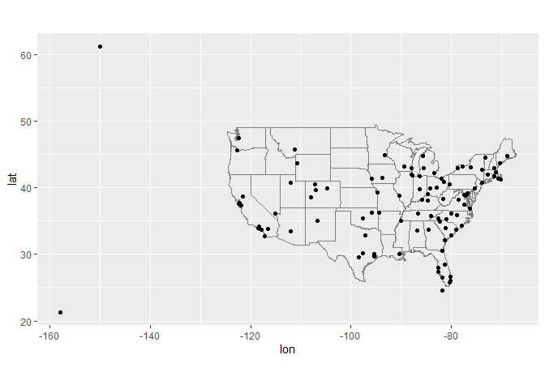
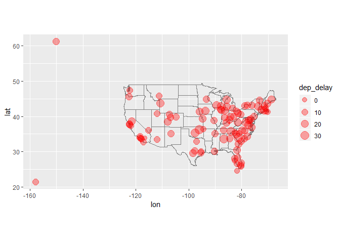
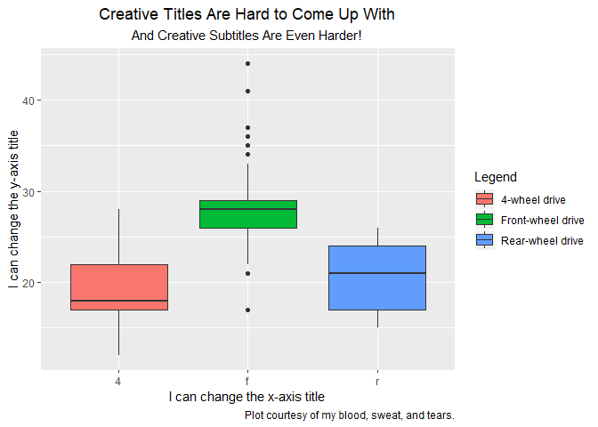
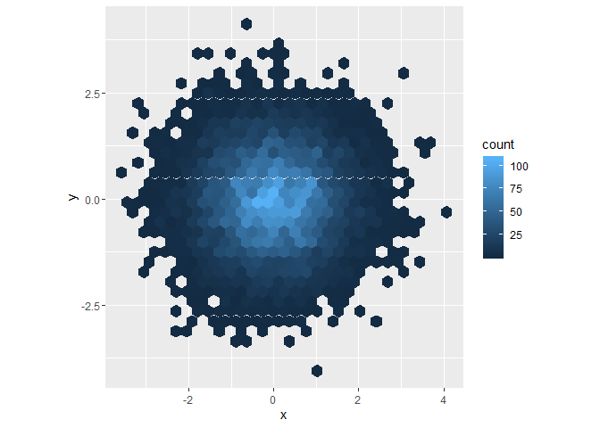
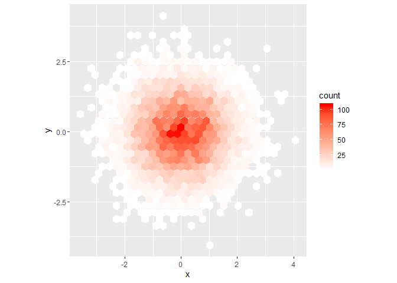
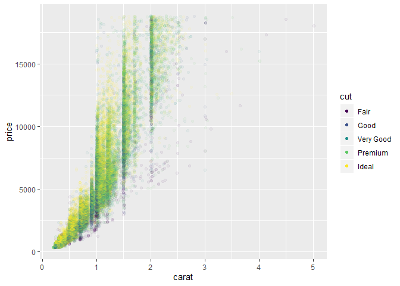

```r
library(tidyverse)
```

```
## Warning: package 'tidyverse' was built under R version 3.5.3
```

```
## -- Attaching packages --------------------------------------------------------------------------------------------------------------------------- tidyverse 1.2.1 --
```

```
## v ggplot2 3.2.0     v purrr   0.3.0
## v tibble  2.1.1     v dplyr   0.8.1
## v tidyr   0.8.3     v stringr 1.3.1
## v readr   1.3.1     v forcats 0.4.0
```

```
## Warning: package 'ggplot2' was built under R version 3.5.3
```

```
## Warning: package 'tibble' was built under R version 3.5.3
```

```
## Warning: package 'tidyr' was built under R version 3.5.3
```

```
## Warning: package 'readr' was built under R version 3.5.3
```

```
## Warning: package 'dplyr' was built under R version 3.5.3
```

```
## Warning: package 'forcats' was built under R version 3.5.3
```

```
## -- Conflicts ------------------------------------------------------------------------------------------------------------------------------ tidyverse_conflicts() --
## x dplyr::filter() masks stats::filter()
## x dplyr::lag()    masks stats::lag()
```

```r
library(nycflights13)
```

```
## Warning: package 'nycflights13' was built under R version 3.5.3
```

###13.2.1 Problems

Problem 1: You would need variables `origin` and `dest` to draw the path; you would also need `tailnum` to describe each individual plane. In order to access all these variables at once, you would need to combine `planes` and `airports` together. 

Problem 2: As shown in the diagram, `weather` and `airports` are related to one another through `origin`. The relationship could appear as an arrow between `origin` in `weather` and `faa` in `airports`. 

Problem 3: **I'm not sure. What additional type of relationship does it want?**

Problem 4: **I'm not really sure how to answer this one either.**


###13.3.1 Exercises

Problem 1: Let's add a surrogate key that is simply a row number to `flights`. 

```r
( flights_surrogate <- flights %>%
  mutate(number = row_number(year)) )
```

```
## # A tibble: 336,776 x 20
##     year month   day dep_time sched_dep_time dep_delay arr_time
##    <int> <int> <int>    <int>          <int>     <dbl>    <int>
##  1  2013     1     1      517            515         2      830
##  2  2013     1     1      533            529         4      850
##  3  2013     1     1      542            540         2      923
##  4  2013     1     1      544            545        -1     1004
##  5  2013     1     1      554            600        -6      812
##  6  2013     1     1      554            558        -4      740
##  7  2013     1     1      555            600        -5      913
##  8  2013     1     1      557            600        -3      709
##  9  2013     1     1      557            600        -3      838
## 10  2013     1     1      558            600        -2      753
## # ... with 336,766 more rows, and 13 more variables: sched_arr_time <int>,
## #   arr_delay <dbl>, carrier <chr>, flight <int>, tailnum <chr>,
## #   origin <chr>, dest <chr>, air_time <dbl>, distance <dbl>, hour <dbl>,
## #   minute <dbl>, time_hour <dttm>, number <int>
```

Problem 2: Let's find the keys in `Batting` first: 

```r
library(Lahman)
```

```
## Warning: package 'Lahman' was built under R version 3.5.3
```

```r
Batting <- as_tibble(Lahman::Batting)

#Pretty sure `playerID` is a primary key. 

Batting %>%
  count(playerID) %>%
  filter(n > 1)
```

```
## # A tibble: 14,327 x 2
##    playerID      n
##    <chr>     <int>
##  1 aardsda01     9
##  2 aaronha01    23
##  3 aaronto01     7
##  4 aasedo01     13
##  5 abadan01      3
##  6 abadfe01      9
##  7 abadijo01     2
##  8 abbated01    10
##  9 abbeybe01     6
## 10 abbeych01     5
## # ... with 14,317 more rows
```

```r
#It isn't. But what about `playerID` and `yearID`?

Batting %>%
  count(playerID, yearID) %>%
  filter(n > 1)
```

```
## # A tibble: 7,432 x 3
##    playerID  yearID     n
##    <chr>      <int> <int>
##  1 abadfe01    2016     2
##  2 abadijo01   1875     2
##  3 abbated01   1910     2
##  4 abbeybe01   1895     2
##  5 abbotgl01   1983     2
##  6 abbotji01   1995     2
##  7 abbotku01   1998     2
##  8 abbotpa01   2004     2
##  9 aberal01    1953     2
## 10 aberal01    1957     2
## # ... with 7,422 more rows
```

```r
#Each observation appears exactly twice. Why?
arrange(Batting, playerID, yearID)
```

```
## # A tibble: 105,861 x 22
##    playerID yearID stint teamID lgID      G    AB     R     H   X2B   X3B
##    <chr>     <int> <int> <fct>  <fct> <int> <int> <int> <int> <int> <int>
##  1 aardsda~   2004     1 SFN    NL       11     0     0     0     0     0
##  2 aardsda~   2006     1 CHN    NL       45     2     0     0     0     0
##  3 aardsda~   2007     1 CHA    AL       25     0     0     0     0     0
##  4 aardsda~   2008     1 BOS    AL       47     1     0     0     0     0
##  5 aardsda~   2009     1 SEA    AL       73     0     0     0     0     0
##  6 aardsda~   2010     1 SEA    AL       53     0     0     0     0     0
##  7 aardsda~   2012     1 NYA    AL        1     0     0     0     0     0
##  8 aardsda~   2013     1 NYN    NL       43     0     0     0     0     0
##  9 aardsda~   2015     1 ATL    NL       33     1     0     0     0     0
## 10 aaronha~   1954     1 ML1    NL      122   468    58   131    27     6
## # ... with 105,851 more rows, and 11 more variables: HR <int>, RBI <int>,
## #   SB <int>, CS <int>, BB <int>, SO <int>, IBB <int>, HBP <int>,
## #   SH <int>, SF <int>, GIDP <int>
```

```r
#Maybe when a plater changes teams, they get a new entry. If we're a bit more specific, we should be able to define a primary key using these variables:

Batting %>%
  count(playerID, yearID, teamID) %>%
  filter(n > 1) 
```

```
## # A tibble: 69 x 4
##    playerID  yearID teamID     n
##    <chr>      <int> <fct>  <int>
##  1 alyeabr01   1972 OAK        2
##  2 anderjo01   1898 BRO        2
##  3 baldwja01   2005 BAL        2
##  4 behrmha01   1947 BRO        2
##  5 chouife01   1914 BRF        3
##  6 clarkje02   2003 TEX        2
##  7 clarkni01   1905 CLE        2
##  8 cranddo01   1913 NY1        2
##  9 cranesa01   1890 NY1        2
## 10 donahpa01   1910 PHA        2
## # ... with 59 more rows
```

```r
#Nope. What if we add `stint`?

Batting %>%
  count(playerID, yearID, teamID, stint) %>%
  filter(n > 1)
```

```
## # A tibble: 0 x 5
## # ... with 5 variables: playerID <chr>, yearID <int>, teamID <fct>,
## #   stint <int>, n <int>
```

```r
Batting %>%
  count(playerID, yearID, stint) %>%
  filter(n > 1)
```

```
## # A tibble: 0 x 4
## # ... with 4 variables: playerID <chr>, yearID <int>, stint <int>, n <int>
```

```r
Batting %>%
  count(playerID, teamID, stint) %>%
  filter(n > 1)
```

```
## # A tibble: 20,616 x 4
##    playerID  teamID stint     n
##    <chr>     <fct>  <int> <int>
##  1 aardsda01 SEA        1     2
##  2 aaronha01 ATL        1     9
##  3 aaronha01 ML1        1    12
##  4 aaronha01 ML4        1     2
##  5 aaronto01 ATL        1     4
##  6 aaronto01 ML1        1     3
##  7 aasedo01  BAL        1     4
##  8 aasedo01  CAL        1     6
##  9 abadfe01  HOU        1     3
## 10 abadfe01  OAK        1     2
## # ... with 20,606 more rows
```

It would appear that the minimum key for `Batting` is (`playerID`, `teamID`, `stint`). 


```r
library(babynames)
```

```
## Warning: package 'babynames' was built under R version 3.5.3
```

```r
babynames
```

```
## # A tibble: 1,924,665 x 5
##     year sex   name          n   prop
##    <dbl> <chr> <chr>     <int>  <dbl>
##  1  1880 F     Mary       7065 0.0724
##  2  1880 F     Anna       2604 0.0267
##  3  1880 F     Emma       2003 0.0205
##  4  1880 F     Elizabeth  1939 0.0199
##  5  1880 F     Minnie     1746 0.0179
##  6  1880 F     Margaret   1578 0.0162
##  7  1880 F     Ida        1472 0.0151
##  8  1880 F     Alice      1414 0.0145
##  9  1880 F     Bertha     1320 0.0135
## 10  1880 F     Sarah      1288 0.0132
## # ... with 1,924,655 more rows
```

```r
babynames %>%
  count(name) %>%
  filter(n > 1)
```

```
## # A tibble: 76,467 x 2
##    name          n
##    <chr>     <int>
##  1 Aaban        10
##  2 Aabha         5
##  3 Aabid         2
##  4 Aabriella     5
##  5 Aadam        26
##  6 Aadan        11
##  7 Aadarsh      17
##  8 Aaden        18
##  9 Aadesh        4
## 10 Aadhav       11
## # ... with 76,457 more rows
```

```r
babynames %>%
  count(name, sex) %>%
  filter(n > 1)
```

```
## # A tibble: 84,551 x 3
##    name      sex       n
##    <chr>     <chr> <int>
##  1 Aaban     M        10
##  2 Aabha     F         5
##  3 Aabid     M         2
##  4 Aabriella F         5
##  5 Aadam     M        26
##  6 Aadan     M        11
##  7 Aadarsh   M        17
##  8 Aaden     M        17
##  9 Aadesh    M         4
## 10 Aadhav    M        11
## # ... with 84,541 more rows
```

```r
babynames %>%
  count(name, sex, year) %>%
  filter(n > 1)
```

```
## # A tibble: 0 x 4
## # ... with 4 variables: name <chr>, sex <chr>, year <dbl>, n <int>
```

It would appear that the minimum key for `babynames` is (`name`, `sex`, `year`). 


###13.4.6 Problems 

Problem 1: 

```r
airports %>%
  semi_join(flights, c("faa" = "dest")) %>%
  ggplot(aes(lon, lat)) +
    borders("state") +
    geom_point() +
    coord_quickmap()
```

<!-- -->

```r
flights %>% arrange(desc(dep_delay))
```

```
## # A tibble: 336,776 x 19
##     year month   day dep_time sched_dep_time dep_delay arr_time
##    <int> <int> <int>    <int>          <int>     <dbl>    <int>
##  1  2013     1     9      641            900      1301     1242
##  2  2013     6    15     1432           1935      1137     1607
##  3  2013     1    10     1121           1635      1126     1239
##  4  2013     9    20     1139           1845      1014     1457
##  5  2013     7    22      845           1600      1005     1044
##  6  2013     4    10     1100           1900       960     1342
##  7  2013     3    17     2321            810       911      135
##  8  2013     6    27      959           1900       899     1236
##  9  2013     7    22     2257            759       898      121
## 10  2013    12     5      756           1700       896     1058
## # ... with 336,766 more rows, and 12 more variables: sched_arr_time <int>,
## #   arr_delay <dbl>, carrier <chr>, flight <int>, tailnum <chr>,
## #   origin <chr>, dest <chr>, air_time <dbl>, distance <dbl>, hour <dbl>,
## #   minute <dbl>, time_hour <dttm>
```

```r
#Compute average delay by destination. Note that we can do this due to having `dep_delay be an integer 
#(not a weird hour/minute time value: )

( delays <- flights %>%
  drop_na(dep_delay) %>%
  select(dest, dep_delay) %>%
  group_by(dest) %>%
  summarize_each(funs(mean)) )
```

```
## Warning: funs() is soft deprecated as of dplyr 0.8.0
## please use list() instead
## 
##   # Before:
##   funs(name = f(.))
## 
##   # After: 
##   list(name = ~ f(.))
## This warning is displayed once per session.
```

```
## # A tibble: 104 x 2
##    dest  dep_delay
##    <chr>     <dbl>
##  1 ABQ       13.7 
##  2 ACK        6.46
##  3 ALB       23.6 
##  4 ANC       12.9 
##  5 ATL       12.5 
##  6 AUS       13.0 
##  7 AVL        8.19
##  8 BDL       17.7 
##  9 BGR       19.5 
## 10 BHM       29.7 
## # ... with 94 more rows
```

```r
( space_delays <- delays %>%
  left_join(airports, c("dest" = "faa")) %>%
  select(dest:lon) )
```

```
## # A tibble: 104 x 5
##    dest  dep_delay name                                lat    lon
##    <chr>     <dbl> <chr>                             <dbl>  <dbl>
##  1 ABQ       13.7  Albuquerque International Sunport  35.0 -107. 
##  2 ACK        6.46 Nantucket Mem                      41.3  -70.1
##  3 ALB       23.6  Albany Intl                        42.7  -73.8
##  4 ANC       12.9  Ted Stevens Anchorage Intl         61.2 -150. 
##  5 ATL       12.5  Hartsfield Jackson Atlanta Intl    33.6  -84.4
##  6 AUS       13.0  Austin Bergstrom Intl              30.2  -97.7
##  7 AVL        8.19 Asheville Regional Airport         35.4  -82.5
##  8 BDL       17.7  Bradley Intl                       41.9  -72.7
##  9 BGR       19.5  Bangor Intl                        44.8  -68.8
## 10 BHM       29.7  Birmingham Intl                    33.6  -86.8
## # ... with 94 more rows
```

```r
#Now, plot! 
ggplot(space_delays, aes(lon, lat)) + 
  borders("state") + 
  geom_point(aes(size = dep_delay), alpha = 0.35, color = "red") + 
  coord_quickmap() + 
  labs(alpha = "Average departure\n delay (minutes)")
```

```
## Warning: Removed 4 rows containing missing values (geom_point).
```

<!-- -->

Problem 2: Make sure to run the code from Problem 1 first to get the `dest` coordinates. 

```r
airports
```

```
## # A tibble: 1,458 x 8
##    faa   name                    lat    lon   alt    tz dst   tzone        
##    <chr> <chr>                 <dbl>  <dbl> <int> <dbl> <chr> <chr>        
##  1 04G   Lansdowne Airport      41.1  -80.6  1044    -5 A     America/New_~
##  2 06A   Moton Field Municipa~  32.5  -85.7   264    -6 A     America/Chic~
##  3 06C   Schaumburg Regional    42.0  -88.1   801    -6 A     America/Chic~
##  4 06N   Randall Airport        41.4  -74.4   523    -5 A     America/New_~
##  5 09J   Jekyll Island Airport  31.1  -81.4    11    -5 A     America/New_~
##  6 0A9   Elizabethton Municip~  36.4  -82.2  1593    -5 A     America/New_~
##  7 0G6   Williams County Airp~  41.5  -84.5   730    -5 A     America/New_~
##  8 0G7   Finger Lakes Regiona~  42.9  -76.8   492    -5 A     America/New_~
##  9 0P2   Shoestring Aviation ~  39.8  -76.6  1000    -5 U     America/New_~
## 10 0S9   Jefferson County Intl  48.1 -123.    108    -8 A     America/Los_~
## # ... with 1,448 more rows
```

```r
(dest_spot <- airports %>%
  select("dest" = faa , "dest_lat" = lat, "dest_lon" =  lon) )
```

```
## # A tibble: 1,458 x 3
##    dest  dest_lat dest_lon
##    <chr>    <dbl>    <dbl>
##  1 04G       41.1    -80.6
##  2 06A       32.5    -85.7
##  3 06C       42.0    -88.1
##  4 06N       41.4    -74.4
##  5 09J       31.1    -81.4
##  6 0A9       36.4    -82.2
##  7 0G6       41.5    -84.5
##  8 0G7       42.9    -76.8
##  9 0P2       39.8    -76.6
## 10 0S9       48.1   -123. 
## # ... with 1,448 more rows
```

```r
(origins_spot <- airports %>%
  select("origin" = faa, "origin_lat" = lat, "origin_lon" = lon))
```

```
## # A tibble: 1,458 x 3
##    origin origin_lat origin_lon
##    <chr>       <dbl>      <dbl>
##  1 04G          41.1      -80.6
##  2 06A          32.5      -85.7
##  3 06C          42.0      -88.1
##  4 06N          41.4      -74.4
##  5 09J          31.1      -81.4
##  6 0A9          36.4      -82.2
##  7 0G6          41.5      -84.5
##  8 0G7          42.9      -76.8
##  9 0P2          39.8      -76.6
## 10 0S9          48.1     -123. 
## # ... with 1,448 more rows
```

```r
(flights_dest <- flights %>%
  left_join(dest_spot, by = "dest") %>%
  left_join(origins_spot, by = "origin") )
```

```
## # A tibble: 336,776 x 23
##     year month   day dep_time sched_dep_time dep_delay arr_time
##    <int> <int> <int>    <int>          <int>     <dbl>    <int>
##  1  2013     1     1      517            515         2      830
##  2  2013     1     1      533            529         4      850
##  3  2013     1     1      542            540         2      923
##  4  2013     1     1      544            545        -1     1004
##  5  2013     1     1      554            600        -6      812
##  6  2013     1     1      554            558        -4      740
##  7  2013     1     1      555            600        -5      913
##  8  2013     1     1      557            600        -3      709
##  9  2013     1     1      557            600        -3      838
## 10  2013     1     1      558            600        -2      753
## # ... with 336,766 more rows, and 16 more variables: sched_arr_time <int>,
## #   arr_delay <dbl>, carrier <chr>, flight <int>, tailnum <chr>,
## #   origin <chr>, dest <chr>, air_time <dbl>, distance <dbl>, hour <dbl>,
## #   minute <dbl>, time_hour <dttm>, dest_lat <dbl>, dest_lon <dbl>,
## #   origin_lat <dbl>, origin_lon <dbl>
```


###13.5.1 Exercises

Problem 2: 

```r
#This one's too easy. 
( too_many <- flights %>%
    count(tailnum) %>%
    filter(n >= 100) %>%
    drop_na(tailnum) %>%
    arrange(desc(n)) %>%
    rename("flight_num" = n))
```

```
## # A tibble: 1,217 x 2
##    tailnum flight_num
##    <chr>        <int>
##  1 N725MQ         575
##  2 N722MQ         513
##  3 N723MQ         507
##  4 N711MQ         486
##  5 N713MQ         483
##  6 N258JB         427
##  7 N298JB         407
##  8 N353JB         404
##  9 N351JB         402
## 10 N735MQ         396
## # ... with 1,207 more rows
```

Problem 4: This problem is either extremely easy or extremely difficult depending on how you define the **very** vaguely-defined words "48 hours" and "worst". Let's just do this in R club tonight. 
One way you might attempt it: 

```r
flights
```

```
## # A tibble: 336,776 x 19
##     year month   day dep_time sched_dep_time dep_delay arr_time
##    <int> <int> <int>    <int>          <int>     <dbl>    <int>
##  1  2013     1     1      517            515         2      830
##  2  2013     1     1      533            529         4      850
##  3  2013     1     1      542            540         2      923
##  4  2013     1     1      544            545        -1     1004
##  5  2013     1     1      554            600        -6      812
##  6  2013     1     1      554            558        -4      740
##  7  2013     1     1      555            600        -5      913
##  8  2013     1     1      557            600        -3      709
##  9  2013     1     1      557            600        -3      838
## 10  2013     1     1      558            600        -2      753
## # ... with 336,766 more rows, and 12 more variables: sched_arr_time <int>,
## #   arr_delay <dbl>, carrier <chr>, flight <int>, tailnum <chr>,
## #   origin <chr>, dest <chr>, air_time <dbl>, distance <dbl>, hour <dbl>,
## #   minute <dbl>, time_hour <dttm>
```

```r
( too_long <- flights %>%
  unite(col = m_d_h, month, day, hour) %>%
  drop_na(dep_delay) %>%
  drop_na(m_d_h) %>%
  select(m_d_h, dep_delay) %>%
  group_by(m_d_h) %>%
  summarize_each(funs(mean)) %>%
  arrange(desc(dep_delay)) )
```

```
## # A tibble: 6,923 x 2
##    m_d_h   dep_delay
##    <chr>       <dbl>
##  1 2_9_10       269 
##  2 4_10_22      176.
##  3 4_10_20      170.
##  4 4_10_21      168.
##  5 4_10_23      159 
##  6 4_19_22      157 
##  7 7_28_19      156.
##  8 4_10_19      152.
##  9 2_9_9        151 
## 10 4_19_19      150.
## # ... with 6,913 more rows
```

```r
( weather2 <- weather %>%
  unite(col = m_d_h, month, day, hour) %>%
  select(-(origin:year)) %>% 
  drop_na(m_d_h) %>%
  group_by(m_d_h) %>%
  summarize_each(funs(mean)) )
```

```
## # A tibble: 8,713 x 11
##    m_d_h  temp  dewp humid wind_dir wind_speed wind_gust precip pressure
##    <chr> <dbl> <dbl> <dbl>    <dbl>      <dbl>     <dbl>  <dbl>    <dbl>
##  1 1_1_1  39.3  26.1  58.7     263.       12.3        NA      0    1012.
##  2 1_1_~  40.6  27.4  58.9     263.       14.2        NA      0    1012.
##  3 1_1_~  40.6  26.7  57.2     273.       15.3        NA      0    1011.
##  4 1_1_~  37.9  28.4  69.7     330        17.3        NA      0      NA 
##  5 1_1_~  38.4  26.7  64.5     327.       15.7        NA      0      NA 
##  6 1_1_~  39.0  24.1  54.7     297.       11.5        NA      0    1011.
##  7 1_1_~  38.7  23    53.1     297.       11.5        NA      0    1012.
##  8 1_1_~  37.6  19.6  47.9     317.       14.2        NA      0    1012.
##  9 1_1_~  36.3  17.7  46.5     320        15.3        NA      0    1013.
## 10 1_1_~  34.3  15.0  44.7     313.       14.2        NA      0    1014.
## # ... with 8,703 more rows, and 2 more variables: visib <dbl>,
## #   time_hour <dttm>
```

```r
( cross_ref <- too_long %>%
  left_join(weather2, "m_d_h"))
```

```
## # A tibble: 6,923 x 12
##    m_d_h dep_delay  temp  dewp humid wind_dir wind_speed wind_gust  precip
##    <chr>     <dbl> <dbl> <dbl> <dbl>    <dbl>      <dbl>     <dbl>   <dbl>
##  1 2_9_~      269   27.4  16.3  62.8     307.      22.2       30.7 0      
##  2 4_10~      176.  57.3  54.7  91.2      NA        4.99      NA   0.147  
##  3 4_10~      170.  58.0  53.1  84.0      NA        9.59      NA   0.07   
##  4 4_10~      168.  57.0  51.9  84.8     157.       7.29      NA   0.00333
##  5 4_10~      159   57.8  55.1  93       173.       7.29      NA   0.0933 
##  6 4_19~      157   62.7  58.8  89.3      NA       19.2       NA   0.0133 
##  7 7_28~      156.  74.2  70.2  87.4      NA        7.67      NA   0.03   
##  8 4_10~      152.  60.0  52.0  77.5     253.      25.7       NA   0.14   
##  9 2_9_9      151   27.3  17.4  65.8     313.      20.3       31.8 0      
## 10 4_19~      150.  63.4  58.3  84.3     173.      20.3       NA   0      
## # ... with 6,913 more rows, and 3 more variables: pressure <dbl>,
## #   visib <dbl>, time_hour <dttm>
```

```r
#Now we need to search for trends. 
arrange(cross_ref, desc(dep_delay))
```

```
## # A tibble: 6,923 x 12
##    m_d_h dep_delay  temp  dewp humid wind_dir wind_speed wind_gust  precip
##    <chr>     <dbl> <dbl> <dbl> <dbl>    <dbl>      <dbl>     <dbl>   <dbl>
##  1 2_9_~      269   27.4  16.3  62.8     307.      22.2       30.7 0      
##  2 4_10~      176.  57.3  54.7  91.2      NA        4.99      NA   0.147  
##  3 4_10~      170.  58.0  53.1  84.0      NA        9.59      NA   0.07   
##  4 4_10~      168.  57.0  51.9  84.8     157.       7.29      NA   0.00333
##  5 4_10~      159   57.8  55.1  93       173.       7.29      NA   0.0933 
##  6 4_19~      157   62.7  58.8  89.3      NA       19.2       NA   0.0133 
##  7 7_28~      156.  74.2  70.2  87.4      NA        7.67      NA   0.03   
##  8 4_10~      152.  60.0  52.0  77.5     253.      25.7       NA   0.14   
##  9 2_9_9      151   27.3  17.4  65.8     313.      20.3       31.8 0      
## 10 4_19~      150.  63.4  58.3  84.3     173.      20.3       NA   0      
## # ... with 6,913 more rows, and 3 more variables: pressure <dbl>,
## #   visib <dbl>, time_hour <dttm>
```


```r
arrange(cross_ref, desc(wind_dir))
```

```
## # A tibble: 6,923 x 12
##    m_d_h dep_delay  temp  dewp humid wind_dir wind_speed wind_gust precip
##    <chr>     <dbl> <dbl> <dbl> <dbl>    <dbl>      <dbl>     <dbl>  <dbl>
##  1 12_1~    57.2    26.2  21.4  83.4     360       12.3         NA      0
##  2 3_7_~    20.4    38.4  30.7  74.7     360       17.6         NA      0
##  3 3_7_~    11.4    37.0  28.8  71.9     360       22.6         NA      0
##  4 6_14~     3.30   55.5  51.0  84.8     360       16.9         NA      0
##  5 7_16~     0.312  89.7  64.6  43.6     360       10.4         NA      0
##  6 8_23~    -1.28   75.0  61.0  61.9     360       11.9         NA      0
##  7 1_15~    -2.18   39.0  25.3  57.6     360        7.67        NA      0
##  8 2_21~    -2.33   26.4  13.3  57.2     360        9.59        NA      0
##  9 1_15~    -4.28   38.3  25.3  59.3     360       10.4         NA      0
## 10 3_8_~   108.     39.6  30.0  68.5     357.      13.4         NA      0
## # ... with 6,913 more rows, and 3 more variables: pressure <dbl>,
## #   visib <dbl>, time_hour <dttm>
```

```r
arrange(cross_ref, desc(wind_speed))
```

```
## # A tibble: 6,923 x 12
##    m_d_h dep_delay  temp  dewp humid wind_dir wind_speed wind_gust precip
##    <chr>     <dbl> <dbl> <dbl> <dbl>    <dbl>      <dbl>     <dbl>  <dbl>
##  1 1_31~     14.6   47   29.7   50.7    267.        35.7      47.6 0     
##  2 1_31~      7.11  51.2 42.2   71.6    267.        33.0      48.3 0.01  
##  3 3_6_~     30.5   41.4 29.7   62.9     53.3       33.0      42.6 0     
##  4 1_31~     20.2   46.3 19.0   33.4    273.        31.8      44.1 0     
##  5 1_31~      7.97  55.4 50.8   84.8    230         31.5      41.8 0.0133
##  6 3_6_~     32.8   42.2 29.5   61.3     60         30.3      45.6 0     
##  7 1_31~     28.3   42.1 13.7   31.2    270         30.3      44.9 0     
##  8 1_31~     18.8   45.7 20.7   36.7    270         30.3      43.3 0     
##  9 2_17~     22.6   23    1.28  38.4    303.        29.9      38.7 0     
## 10 1_31~     14.5   44.7 25.0   45.7    273.        29.9      46.4 0     
## # ... with 6,913 more rows, and 3 more variables: pressure <dbl>,
## #   visib <dbl>, time_hour <dttm>
```

```r
arrange(cross_ref, desc(wind_gust))
```

```
## # A tibble: 6,923 x 12
##    m_d_h dep_delay  temp  dewp humid wind_dir wind_speed wind_gust precip
##    <chr>     <dbl> <dbl> <dbl> <dbl>    <dbl>      <dbl>     <dbl>  <dbl>
##  1 1_31~      7.11  51.2 42.2   71.6     267.       33.0      48.3   0.01
##  2 1_31~     14.6   47   29.7   50.7     267.       35.7      47.6   0   
##  3 1_31~     42.1   36.0 14     40.2     260        28.4      47.2   0   
##  4 1_31~     14.5   44.7 25.0   45.7     273.       29.9      46.4   0   
##  5 3_6_~     32.8   42.2 29.5   61.3      60        30.3      45.6   0   
##  6 1_31~     28.3   42.1 13.7   31.2     270        30.3      44.9   0   
##  7 11_2~      2.77  27.3  3.68  36.2     307.       29.5      44.9   0   
##  8 1_31~     20.2   46.3 19.0   33.4     273.       31.8      44.1   0   
##  9 1_31~     18.8   45.7 20.7   36.7     270        30.3      43.3   0   
## 10 1_31~     34.8   39.3 14.3   35.7     270        29.5      42.6   0   
## # ... with 6,913 more rows, and 3 more variables: pressure <dbl>,
## #   visib <dbl>, time_hour <dttm>
```

```r
arrange(cross_ref, desc(precip))
```

```
## # A tibble: 6,923 x 12
##    m_d_h dep_delay  temp  dewp humid wind_dir wind_speed wind_gust precip
##    <chr>     <dbl> <dbl> <dbl> <dbl>    <dbl>      <dbl>     <dbl>  <dbl>
##  1 6_7_~      78.6  60.9  58.8  95.6     50        20.3         NA  0.41 
##  2 8_28~     103.   76.1  69.9  81.7     NA         1.15        NA  0.403
##  3 6_2_~      19.3  69.9  65.4  86.4    227.       15.0         NA  0.37 
##  4 12_2~      19.1  43.0  41.4  93.8     43.3      14.2         NA  0.363
##  5 7_1_~      73.5  75.7  71.9  92.8    217.        9.21        NA  0.36 
##  6 7_3_~      25.0  79.3  74.1  87.4    203.       10.4         NA  0.353
##  7 5_8_~      32.8  62    59.1  92.4     90        16.5         NA  0.343
##  8 6_7_~      43.2  61.5  59.6  93.4     36.7      17.3         NA  0.313
##  9 6_7_~      65.3  62.1  59.2  94.5     43.3      19.2         NA  0.31 
## 10 5_8_8      18.0  59.7  57.0  91.8     NA        12.7         NA  0.307
## # ... with 6,913 more rows, and 3 more variables: pressure <dbl>,
## #   visib <dbl>, time_hour <dttm>
```

Welp, I can't see any trends. I tried tho. 

###28.2.1 Problem 1

```r
library(viridis)
```

```
## Warning: package 'viridis' was built under R version 3.5.3
```

```
## Loading required package: viridisLite
```

```r
library(ggrepel)
```

```
## Warning: package 'ggrepel' was built under R version 3.5.3
```

```r
library(tidyverse)
```


```r
#Super easy as well. 
mpg
```

```
## # A tibble: 234 x 11
##    manufacturer model displ  year   cyl trans drv     cty   hwy fl    class
##    <chr>        <chr> <dbl> <int> <int> <chr> <chr> <int> <int> <chr> <chr>
##  1 audi         a4      1.8  1999     4 auto~ f        18    29 p     comp~
##  2 audi         a4      1.8  1999     4 manu~ f        21    29 p     comp~
##  3 audi         a4      2    2008     4 manu~ f        20    31 p     comp~
##  4 audi         a4      2    2008     4 auto~ f        21    30 p     comp~
##  5 audi         a4      2.8  1999     6 auto~ f        16    26 p     comp~
##  6 audi         a4      2.8  1999     6 manu~ f        18    26 p     comp~
##  7 audi         a4      3.1  2008     6 auto~ f        18    27 p     comp~
##  8 audi         a4 q~   1.8  1999     4 manu~ 4        18    26 p     comp~
##  9 audi         a4 q~   1.8  1999     4 auto~ 4        16    25 p     comp~
## 10 audi         a4 q~   2    2008     4 manu~ 4        20    28 p     comp~
## # ... with 224 more rows
```

```r
ggplot(mpg, aes(x = drv, y = hwy)) + 
  geom_boxplot(aes(fill = drv)) + 
  theme(plot.title = element_text(hjust = 0.5), plot.subtitle = element_text(hjust = 0.5)) +
  labs(x = "I can change the x-axis title", y = "I can change the y-axis title", title = "Creative Titles Are Hard to Come Up With", 
       subtitle = "And Creative Subtitles Are Even Harder!", caption = "Plot courtesy of my blood, sweat, and tears.") + 
  scale_fill_discrete(name = "Legend", labels = c("4-wheel drive", "Front-wheel drive", "Rear-wheel drive"))
```

<!-- -->


###28.4.4 Problems 

Problem 1: 

```r
df <- tibble(
  x = rnorm(10000),
  y = rnorm(10000) )

library(hexbin)
```

```
## Warning: package 'hexbin' was built under R version 3.5.3
```

```r
ggplot(df, aes(x, y)) +
  geom_hex() + 
  coord_fixed()
```

<!-- -->

```r
ggplot(df, aes(x, y)) +
  geom_hex() +
  scale_fill_gradient(low = "white", high = "red") +
  coord_fixed()
```

<!-- -->

We used the wrong argument (`color` instead of `fill`) in our scale. 

Problem 4: 

```r
ggplot(diamonds, aes(carat, price)) +
  geom_point(aes(colour = cut), alpha = 1/20) + 
  guides(color = guide_legend(override.aes = list(alpha = 1) ) )
```

<!-- -->

Whew! A bit tricky, but we just needed to override the `alpha` argument. 


